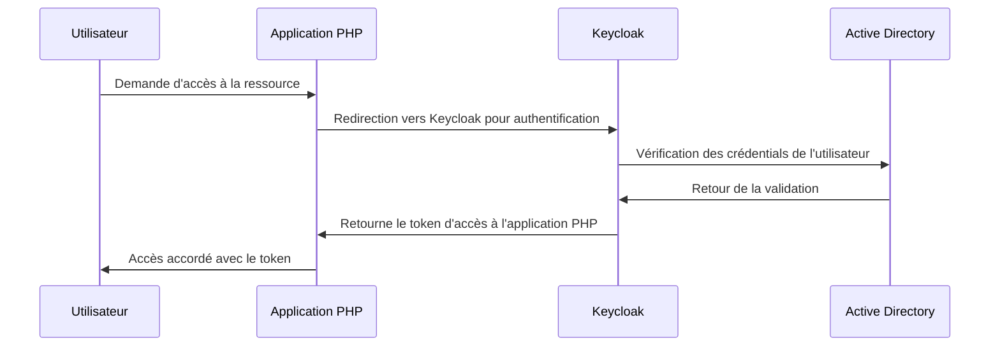

# Intégration de Keycloak avec PHP

Ce guide explique comment intégrer Keycloak à une application PHP pour gérer l'authentification et l'autorisation des utilisateurs.

## Prérequis

- Un serveur Keycloak opérationnel sur le port 8090
- PHP installé localement ou sur un serveur, configuré pour écouter sur le port 8080
- Composer pour la gestion des dépendances PHP

## Étape 1 : Installation de Keycloak (Optionnel)

Si vous n'avez pas encore Keycloak installé et que vous souhaitez configurer un environnement de test ou de développement, suivez ces instructions. Si vous comptez vous connecter à un environnement de recette ou de production déjà en place, vous pouvez passer cette étape.

Téléchargez et installez Keycloak depuis [le site officiel](https://www.keycloak.org/downloads.html). Suivez les instructions pour démarrer le serveur sur le port 8090.

## Étape 2 : Configuration de Keycloak

### Qu'est-ce qu'un Realm ?

Un **realm** dans Keycloak représente un espace virtuel où l'on gère un ensemble d'utilisateurs, leurs rôles, les groupes et les applications. Chaque realm est une entité indépendante avec son propre ensemble d'utilisateurs, clients (applications) et configurations de sécurité. Les realms sont utiles pour configurer des environnements distincts pour différents départements ou projets au sein d'une même organisation.

### Création d'un Realm

1. Connectez-vous à la console d'administration de Keycloak à l'adresse `http://192.168.1.100:8090`.
2. Cliquez sur `Add realm`.
3. Nommez-le `SecureSpaceCRM` et confirmez avec `Create`.

### Création d'un Client

1. Allez à `Clients` dans le menu de gauche et cliquez sur `Create`.
2. Entrez `my_phpCRM_app` comme `Client ID`.
3. Sélectionnez `public` pour `Access Type`.
4. Configurez `Valid Redirect URIs` pour utiliser une adresse IP spécifique (ex. `http://192.168.1.5:8080/*`).
5. Cliquez sur `Save`.

**Synthèse**
   
| Action                       | Description                                                                                                                                                      |
|------------------------------|------------------------------------------------------------------------------------------------------------------------------------------------------------------|
| Création d'un Realm          | - Accédez à `Add realm`.<br>- Nommez le realm `SecureSpaceCRM` et confirmez avec `Create`.                                                                        |
| Création d'un Client         | - Allez à `Clients`.<br>- Cliquez sur `Create`.<br>- Entrez `my_phpCRM_app` comme `Client ID`.<br>- Sélectionnez `public` pour `Access Type`.<br>- Configurez `Valid Redirect URIs` à `http://192.168.1.5:8080/*`.<br>- Cliquez sur `Save`. |
| Ajout d'un Utilisateur       | - Allez à `Users`.<br>- Cliquez sur `Add user`.<br>- Remplissez les champs requis (Username, Email, First Name, Last Name).


### Ajout d'un Utilisateur (Optionnel)

1. Allez à `Users` dans le menu de gauche de la console d'administration de Keycloak.
2. Cliquez sur `Add user`.
3. Remplissez les champs requis pour le nouvel utilisateur :
   - **Username:** Saisissez un nom d'utilisateur, par exemple `koffi`.
   - **Email:** Optionnel, mais vous pouvez saisir une adresse email pour l'utilisateur.
   - **First Name:** Prénom de l'utilisateur.
   - **Last Name:** Nom de famille de l'utilisateur.
   - **Enabled:** Assurez-vous que cette option est activée pour permettre à l'utilisateur de se connecter.
4. Cliquez sur `Save` pour créer l'utilisateur.
5. Après avoir enregistré l'utilisateur, ouvrez l'onglet `Credentials` de l'utilisateur créé.
6. Entrez un mot de passe initial pour l'utilisateur dans le champ `New Password` et confirmez-le dans `Password Confirmation`.
7. Assurez-vous que l'option `Temporary` est décochée si vous ne voulez pas obliger l'utilisateur à changer de mot de passe à sa première connexion.
8. Cliquez sur `Set Password` pour appliquer le nouveau mot de passe.

## Étape 3 : Installation des dépendances PHP

Utilisez Composer pour installer le client OAuth2 :

```bash
composer require league/oauth2-client
```
## Étape 4 : Création du script PHP


Créez un fichier index.php :

** Exemple  simple** 

```php

<?php
require_once 'vendor/autoload.php';

use League\OAuth2\Client\Provider\GenericProvider;

$provider = new GenericProvider([
    'clientId'                => 'my_phpCRM_app',
    'clientSecret'            => '',
    'redirectUri'             => 'http://192.168.1.5:8080/',
    'urlAuthorize'            => 'http://192.168.1.100:8090/auth/realms/SecureSpaceCRM/protocol/openid-connect/auth',
    'urlAccessToken'          => 'http://192.168.1.100:8090/auth/realms/SecureSpaceCRM/protocol/openid-connect/token',
    'urlResourceOwnerDetails' => 'http://192.168.1.100:8090/auth/realms/SecureSpaceCRM/protocol/openid-connect/userinfo'
]);

if (!isset($_GET['code'])) {
    $authorizationUrl = $provider->getAuthorizationUrl();
    $_SESSION['oauth2state'] = $provider->getState();
    header('Location: ' . $authorizationUrl);
    exit;
} elseif (empty($_GET['state']) || ($_GET['state'] !== $_SESSION['oauth2state'])) {
    unset($_SESSION['oauth2state']);
    exit('Invalid state');
} else {
    $accessToken = $provider->getAccessToken('authorization_code', ['code' => $_GET['code']]);
    echo 'Access Token: ' . $accessToken->getToken();
}

```

**Exemple avec gestions des erreurs**


```php
<?php
require_once 'vendor/autoload.php';

use League\OAuth2\Client\Provider\GenericProvider;
use League\OAuth2\Client\Provider\Exception\IdentityProviderException;

session_start();

$provider = new GenericProvider([
    'clientId'                => 'my_phpCRM_app',
    'clientSecret'            => '',  // Assurez-vous de sécuriser le secret client dans un environnement de production
    'redirectUri'             => 'http://192.168.1.5:8080/',
    'urlAuthorize'            => 'http://192.168.1.100:8090/auth/realms/SecureSpaceCRM/protocol/openid-connect/auth',
    'urlAccessToken'          => 'http://192.168.1.100:8090/auth/realms/SecureSpaceCRM/protocol/openid-connect/token',
    'urlResourceOwnerDetails' => 'http://192.168.1.100:8090/auth/realms/SecureSpaceCRM/protocol/openid-connect/userinfo'
]);

try {
    if (!isset($_GET['code'])) {
        $authorizationUrl = $provider->getAuthorizationUrl();
        $_SESSION['oauth2state'] = $provider->getState();
        header('Location: ' . $authorizationUrl);
        exit;
    } elseif (empty($_GET['state']) || ($_GET['state'] !== $_SESSION['oauth2state'])) {
        unset($_SESSION['oauth2state']);
        throw new Exception('Invalid state');
    } else {
        $accessToken = $provider->getAccessToken('authorization_code', ['code' => $_GET['code']]);
        echo 'Access Token: ' . $accessToken->getToken();
    }
} catch (IdentityProviderException $e) {
    // Token acquisition failed
    exit('Token acquisition failed: ' . $e->getMessage());
} catch (Exception $e) {
    // Other errors
    exit('An error occurred: ' . $e->getMessage());
}
```

**Synthèse**

| Fichier      | Action                                                                                                                                                                   |
|--------------|--------------------------------------------------------------------------------------------------------------------------------------------------------------------------|
| `index.php`  | - Créer le fichier PHP.                                                                                                                                                  |
| Configuration| - Importer les dépendances avec `require_once 'vendor/autoload.php'`.                                                                                                     |
|              | - Utiliser la classe `League\OAuth2\Client\Provider\GenericProvider`.                                                                                                     |
|              | - Configurer l'instance de `GenericProvider` avec les paramètres :                                                                                                        |
|              |   - `clientId` : `my_phpCRM_app`                                                                                                                                            |
|              |   - `clientSecret` : `''` (laisser vide pour un client public)                                                                                                           |
|              |   - `redirectUri` : `http://192.168.1.5:8080/`                                                                                                                           |
|              |   - `urlAuthorize` : `http://192.168.1.100:8090/auth/realms/SecureSpaceCRM/protocol/openid-connect/auth`                                                                 |
|              |   - `urlAccessToken` : `http://192.168.1.100:8090/auth/realms/SecureSpaceCRM/protocol/openid-connect/token`                                                              |
|              |   - `urlResourceOwnerDetails` : `http://192.168.1.100:8090/auth/realms/SecureSpaceCRM/protocol/openid-connect/userinfo`                                                  |

## Étape 5 : Diagramme de Séquence Détaillé



### Synthèse de l'Ajout de la Gestion des Erreurs

| Action                           | Description                                                                                                                                                             |
|----------------------------------|-------------------------------------------------------------------------------------------------------------------------------------------------------------------------|
| Importation des classes          | Importer `GenericProvider` et `IdentityProviderException` de la bibliothèque OAuth2 pour gérer l'authentification et les exceptions.                                    |
| Démarrage de session             | Démarrer une session PHP pour sauvegarder l'état OAuth2 entre les requêtes.                                                                                             |
| Configuration de `GenericProvider` | Définir les paramètres du fournisseur OAuth2 incluant les URLs pour l'autorisation, l'obtention du token, et les informations de l'utilisateur.                         |
| Bloc `try-catch`                 | Utiliser un bloc `try-catch` pour attraper et gérer les exceptions durant l'authentification et l'échange de token.                                                     |
| Gestion de `IdentityProviderException` | Attraper spécifiquement les exceptions liées à l'échec de l'acquisition du token pour fournir un message d'erreur clair.                                                 |
| Gestion des autres exceptions    | Attraper toutes les autres exceptions pour éviter les interruptions de script et fournir des détails pour le débogage.                                                  |

Ce tableau offre un aperçu clair des étapes ajoutées au script PHP pour gérer les erreurs, rendant le processus d'intégration avec Keycloak plus résilient aux problèmes potentiels. Cela permet également aux développeurs qui utilisent le guide de comprendre rapidement les modifications et les ajouts sans avoir à analyser tout le script modifié en détail.


## Étape 6 : Exécution et Test

- Lancez le serveur PHP sur un port spécifique (ex. `php -S 192.168.1.5:8080` dans le répertoire de votre projet).
- Accédez à `http://192.168.1.5:8080/` dans votre navigateur.
- Vous serez redirigé vers Keycloak pour la connexion.
- Utilisez les informations d'identification de l'utilisateur de test pour vous connecter :
  - **Username:** koffi
  - **Password:** ing2024

## Commentaire sur l'utilisation de `localhost`

- Pour un développement et des tests locaux, remplacez `192.168.1.5` par `localhost` et ajustez les ports comme nécessaire.

## Conclusion

Vous avez maintenant une application PHP capable de s'authentifier via Keycloak en utilisant les informations de connexion d'un utilisateur de test. Adaptez les paramètres et les configurations selon les besoins spécifiques de votre projet.

